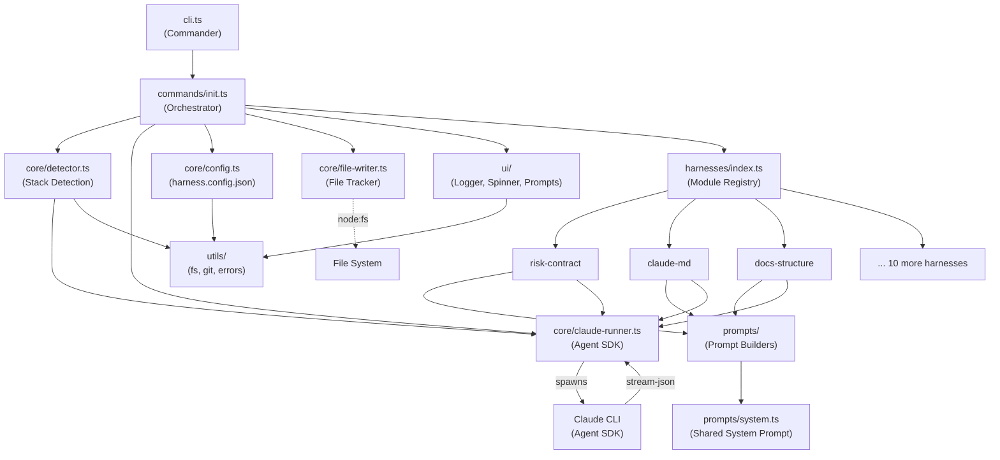
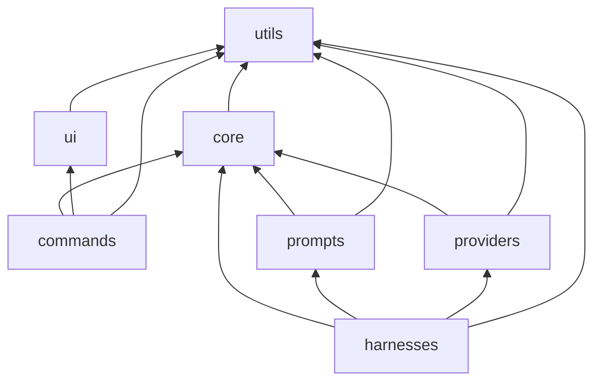

# Architecture

CodeFactory is a CLI tool that automates harness engineering setup for AI coding agents. It analyzes any Git repository, detects its technology stack, and generates 13 production-grade harness artifacts — CI workflows, review-agent integration, risk-tiered gates, documentation structures, and more.

## Project Structure

```
codefactory/
├── src/
│   ├── index.ts              # Executable entry point (shebang via tsup banner)
│   ├── cli.ts                # Commander.js program definition
│   ├── commands/             # CLI command handlers
│   │   └── init.ts           # Main orchestration: detect → prompt → generate
│   ├── core/                 # Engine: detection, generation, config, file tracking
│   │   ├── claude-runner.ts  # Agent SDK wrapper (analyze + generate)
│   │   ├── config.ts         # harness.config.json loader/saver
│   │   ├── detector.ts       # Two-phase stack detection (heuristic + Claude)
│   │   └── file-writer.ts    # File creation/modification tracker
│   ├── harnesses/            # 13 harness modules (HarnessModule interface)
│   │   ├── types.ts          # HarnessModule, HarnessContext, HarnessOutput contracts
│   │   ├── index.ts          # Registry: getHarnessModules(), getHarnessById()
│   │   └── *.ts              # One file per harness (risk-contract, ci-pipeline, etc.)
│   ├── prompts/              # Prompt templates sent to Claude for each harness
│   │   ├── system.ts         # Shared system prompt (role, principles, risk model)
│   │   ├── detect-stack.ts   # Stack detection prompt
│   │   └── *.ts              # One prompt builder per harness
│   ├── providers/            # CI provider adapters
│   │   ├── types.ts          # CIProvider, WorkflowConfig, WorkflowJob interfaces
│   │   └── github-actions.ts # GitHub Actions YAML generator
│   ├── ui/                   # Terminal output: logger, spinner, interactive prompts
│   │   ├── logger.ts         # Chalk-based colored output (info, success, warn, error)
│   │   ├── spinner.ts        # Ora spinner with withSpinner() wrapper
│   │   └── prompts.ts        # Inquirer-based interactive prompts
│   └── utils/                # Pure utilities — no cross-layer imports
│       ├── errors.ts         # Custom Error subclasses
│       ├── fs.ts             # fileExists, readFileIfExists, getDirectoryTree
│       └── git.ts            # isGitRepo, getRepoRoot, getRemoteUrl
├── templates/                # Skeleton files used by harness modules
│   ├── claude-md-skeleton.md
│   ├── harness-config-skeleton.json
│   ├── pr-template.md
│   ├── docs/                 # Template architecture/conventions docs
│   └── issue-templates/      # GitHub issue templates
├── tests/                    # Vitest test suite
│   ├── unit/                 # Unit tests for core, detector, harnesses
│   └── integration/          # End-to-end init flow tests
├── dist/                     # Build output (tsup, ESM, shebang banner)
├── harness.config.json       # This project's own harness configuration
├── CLAUDE.md                 # Agent instruction file for this project
└── package.json              # ESM package with "bin": {"codefactory": "./dist/index.js"}
```

**Entry points**: `src/index.ts` imports the Commander program from `src/cli.ts` and calls `program.parse()`. The `cli.ts` file defines the `codefactory init` command, which dynamically imports `src/commands/init.ts` on invocation.

## Architectural Pattern

CodeFactory follows a **layered modular architecture** with strict unidirectional dependency flow. Each `src/` subdirectory is a layer with explicitly declared allowed imports, enforced via `architecturalBoundaries` in `harness.config.json`.

This pattern suits the project because:

1. **Clear separation of concerns** — prompt engineering, CI provider logic, and CLI orchestration live in independent layers that evolve separately.
2. **Plugin-style extensibility** — new harness modules and CI providers are added by implementing an interface and registering in a barrel file, with zero changes to core logic.
3. **Testability** — pure utilities and the core engine have no upward dependencies, making them trivially testable in isolation.
4. **Dependency safety** — the strict import rules prevent circular dependencies and ensure changes to leaf layers (`utils`, `ui`) never cascade into unrelated modules.

Key design principles:
- **Interface-driven contracts**: `HarnessModule`, `CIProvider`, and `DetectionResult` define the contracts between layers.
- **Dependency inversion**: Harness modules receive a `HarnessContext` (containing `ClaudeRunner`, `FileWriter`, and detection results) rather than constructing their own dependencies.
- **Fail-soft execution**: Each harness runs in a try/catch — a single harness failure logs a warning and does not abort the remaining harnesses.

## Component Diagram



## Layer Structure

### commands
- **Responsibility**: CLI command handlers that orchestrate the full init flow.
- **Contains**: `init.ts` — the 10-step orchestration: pre-flight checks, detection, user prompts, harness execution, config persistence, git commit, and summary output.
- **Allowed imports**: `core`, `ui`, `utils`

### core
- **Responsibility**: The engine — stack detection, Claude SDK integration, configuration I/O, and file tracking.
- **Contains**: `ClaudeRunner` (spawns `claude` CLI with `--output-format stream-json`, parses JSONL, tracks file operations), `detector.ts` (two-phase: heuristic file checks + Claude-powered deep analysis via Zod-validated schema), `config.ts` (load/save `harness.config.json`), `file-writer.ts` (tracks created vs modified files).
- **Allowed imports**: `utils`

### harnesses
- **Responsibility**: The 13 harness modules, each generating a specific set of artifacts.
- **Contains**: `types.ts` (the `HarnessModule` interface with `name`, `order`, `isApplicable()`, `execute()`), `index.ts` (registry sorted by `order`), and one file per harness module.
- **Allowed imports**: `core`, `prompts`, `providers`, `utils`

### prompts
- **Responsibility**: Prompt templates sent to Claude for each harness generation step.
- **Contains**: `system.ts` (shared system prompt establishing Claude's role, risk-tier model, and SHA discipline), `detect-stack.ts` (stack analysis prompt), and one prompt builder per harness module.
- **Allowed imports**: `core`, `utils`

### providers
- **Responsibility**: CI provider adapters that translate `WorkflowConfig` objects into provider-specific YAML/config.
- **Contains**: `types.ts` (`CIProvider`, `WorkflowConfig`, `WorkflowJob`, `WorkflowStep` interfaces), `github-actions.ts` (YAML generation via the `yaml` package, with helper methods for checkout, node setup, caching).
- **Allowed imports**: `core`, `utils`

### ui
- **Responsibility**: Terminal output and interactive user input.
- **Contains**: `logger.ts` (Chalk-based methods: `info`, `success`, `warn`, `error`, `debug`, `header`, `dim`, `fileCreated`, `fileModified`), `spinner.ts` (Ora-based `withSpinner<T>()` async wrapper), `prompts.ts` (Inquirer-based `confirmPrompt`, `selectPrompt`, `multiselectPrompt`, `inputPrompt`).
- **Allowed imports**: `utils`

### utils
- **Responsibility**: Pure utility functions with zero cross-layer dependencies.
- **Contains**: `errors.ts` (custom error classes: `UserCancelledError`, `ClaudeNotFoundError`, `NotAGitRepoError`), `fs.ts` (`fileExists`, `readFileIfExists`, `getDirectoryTree`), `git.ts` (`isGitRepo`, `getRepoRoot`, `getRemoteUrl`).
- **Allowed imports**: none (leaf layer)

### Dependency Diagram



## Data Flow

A typical `codefactory init` execution follows this path:

1. **CLI parsing** — Commander parses `codefactory init [--skip-detection] [--dry-run]`, dynamically imports `commands/init.ts`.

2. **Pre-flight** — `init.ts` calls `isGitRepo()` and `getRepoRoot()` from `utils/git.ts`. Checks for an existing `harness.config.json` via `loadHarnessConfig()`.

3. **Heuristic detection** — `runHeuristicDetection()` performs fast file-existence checks (package.json, tsconfig.json, go.mod, etc.) to identify languages, framework, package manager, and CI provider. No Claude call required.

4. **Deep detection** (optional) — `runFullDetection()` sends a Claude `analyze()` call with the heuristic results and a directory tree. Claude reads config files, identifies the test framework, linter, formatter, build tool, architectural layers, and critical paths. The response is validated against a Zod schema (`detectionResultSchema`).

5. **User preferences** — The detection summary is displayed. The user confirms or corrects it, selects a CI provider, chooses harnesses to install (pre-checked based on `isApplicable()`), optionally edits critical paths, and picks a strictness level (relaxed/standard/strict).

6. **Harness execution** — Selected harness modules run in `order` sequence. Each module builds a prompt from `src/prompts/`, calls `ctx.runner.generate(prompt, systemPrompt)`, which spawns the `claude` CLI. Claude reads relevant files, generates artifacts via Write/Edit tools, and streams results back as JSONL. The runner parses the stream, tracks created/modified files, and returns a `GenerateResult`. Each module's output is stored in `previousOutputs` so later modules can reference earlier artifacts.

7. **Post-processing** — Harness-specific npm scripts are added to `package.json`. The `HarnessConfig` is saved. A summary of all created/modified files is displayed, and the user is offered a git commit.

## External Dependencies

| Dependency | Purpose | Abstraction |
|---|---|---|
| **Claude CLI** (`claude`) | AI-powered code analysis and file generation | `ClaudeRunner` wraps the CLI as a child process with `--output-format stream-json`, exposing `analyze<T>()` and `generate()` |
| **GitHub Actions** | CI/CD workflow execution | `GitHubActionsProvider` implements `CIProvider` interface, generating YAML via the `yaml` package |
| **Git** | Repository metadata (root, remote URL, status) | `utils/git.ts` wraps `git` CLI calls via `child_process.exec` |

The Claude CLI dependency is the only runtime requirement beyond Node.js. It is spawned as a subprocess with explicit `--allowedTools` whitelists per operation — `analyze()` permits only read-only tools (`Read`, `Glob`, `Grep`, `Bash`), while `generate()` additionally permits `Write` and `Edit`.

## Architecture Decision Records

### ADR-001: Claude CLI as a Child Process

**Status**: Accepted

**Context**: CodeFactory needs to leverage Claude's capabilities for code analysis and file generation. Options included the HTTP API, the TypeScript SDK, or the Claude CLI.

**Decision**: Use the Claude CLI spawned via `child_process.spawn` with `--output-format stream-json`.

**Rationale**: The CLI provides built-in tool execution (Read, Write, Edit, Glob, Grep, Bash) with sandboxing and permission controls. The `--allowedTools` flag enables least-privilege per operation. Stream-JSON output allows real-time file tracking without post-hoc diffing.

### ADR-002: Two-Phase Detection

**Status**: Accepted

**Context**: Repository analysis must balance speed and accuracy.

**Decision**: Phase 1 (heuristic) checks file existence synchronously; Phase 2 (Claude-powered) refines results by reading actual config files.

**Rationale**: Heuristics provide a fast baseline (~100ms) and work offline. Claude analysis adds deep understanding (actual commands, architectural layers, critical paths) but costs time and API tokens. The `--skip-detection` flag lets users opt out of Phase 2.

### ADR-003: Interface-Driven Harness Modules

**Status**: Accepted

**Context**: The system needs 13+ harness types that can be independently developed, tested, and toggled.

**Decision**: Every harness implements `HarnessModule` with `name`, `order`, `isApplicable()`, and `execute()`. A registry in `harnesses/index.ts` collects and sorts them.

**Rationale**: This enables the init flow to iterate over modules generically without knowing their internals. The `order` field establishes a dependency chain (risk-contract runs first, ci-pipeline runs sixth), and `previousOutputs` allows later modules to reference earlier outputs.

### Template for Future ADRs

```markdown
### ADR-NNN: [Title]

**Status**: Proposed | Accepted | Deprecated | Superseded by ADR-XXX

**Context**: What is the issue that we're seeing that is motivating this decision?

**Decision**: What is the change that we're proposing and/or doing?

**Rationale**: Why is this the best choice given the constraints?

**Consequences**: What trade-offs does this decision introduce?
```
